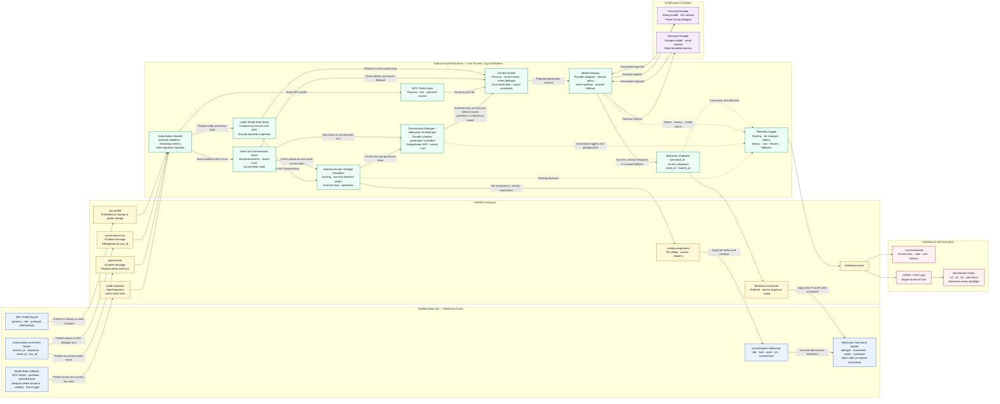

# Garena Sahur

## System architecture

```mermaid
flowchart LR

    %% =========================================================
    %% MODDED MINECRAFT
    %% =========================================================
    subgraph MC["Modded Minecraft — Reference Game"]
        direction TB

        COLLECT["World-State Collector<br/>NPC UUIDs · positions · world distance<br/>viewport-centre distance · visibility · line of sight"]

        HOOKS["Conversation and Event Hooks<br/>session_id · sequence · event_id · turn_id"]

        PROFILE_SRC["NPC Profile Export<br/>persona · role · authored relationships"]

        AMBIENT["Local Ambient Behaviour<br/>idle · look · point · run · cached lines"]

        APPLY["Behaviour Command Applier<br/>dialogue · movement · action · animation<br/>reject stale or expired commands"]
    end


    %% =========================================================
    %% PUB/SUB TRANSPORT
    %% =========================================================
    subgraph BUS["Pub/Sub Transport"]
        direction TB

        SNAP["world.snapshot<br/>High frequency<br/>Latest value wins"]

        EVENT["game.event<br/>Durable message<br/>Deduplicate by event_id"]

        TURN["conversation.turn<br/>Durable message<br/>Deduplicate by turn_id"]

        PROFILE_TOPIC["npc.profile<br/>Published on startup or profile change"]

        ASSIGN["routing.assignment<br/>Tier deltas · scores · reasons"]

        COMMAND["behaviour.command<br/>Ordered · source sequence · expiry"]

        TELEMETRY_TOPIC["telemetry.record"]
    end


    %% =========================================================
    %% PYTHON BACKEND
    %% =========================================================
    subgraph BACKEND["Python FastAPI Backend — One Process, Logical Modules"]
        direction TB

        INGEST["Subscription Handler<br/>Schema validation · timestamp checks<br/>stale-sequence rejection"]

        STATE["Latest World-State Store<br/>Coalesce by session and NPC<br/>Discard obsolete snapshots"]

        EVENT_STORE["Event and Conversation Store<br/>Structured events · recent turns<br/>conversation state"]

        PROFILE_STORE["NPC Profile Store<br/>Persona · role · authored context"]

        ROUTER["Attention Router / Budget Scheduler<br/>Scoring · one-hop attention graph<br/>hard tier caps · hysteresis"]

        ORCH["Conversation Manager / Behaviour Orchestrator<br/>Decides whether generation is needed<br/>Deduplicates NPC + event + turn"]

        CONTEXT["Context Builder<br/>Persona · current event · recent dialogue<br/>local world state · output constraints"]

        GATEWAY["Model Gateway<br/>Provider adapters · timeout policy<br/>error handling · scripted fallback"]

        PUBLISH["Behaviour Publisher<br/>command_id · source_sequence<br/>event_id · expires_at"]

        METRICS["Telemetry Logger<br/>Routing · tier changes · tokens<br/>latency · cost · failures · fallbacks"]
    end


    %% =========================================================
    %% AI PROVIDERS
    %% =========================================================
    subgraph MODELS["AI Behaviour Providers"]
        direction TB

        FOCUSED["Focused Provider<br/>Strong model · rich context<br/>Player-facing dialogue"]

        REACTIVE["Reactive Provider<br/>Cheaper model · small context<br/>Short bounded reaction"]
    end


    %% =========================================================
    %% DASHBOARD AND EVALUATION
    %% =========================================================
    subgraph EVAL["Dashboard and Evaluation"]
        direction TB

        DASH["Live Dashboard<br/>Current tiers · calls · cost · latency"]

        LOG["JSONL / CSV Logs<br/>Single source of truth"]

        CHART["Benchmark Charts<br/>10 · 25 · 50 · 100 NPCs<br/>Baselines versus Spotlight"]
    end


    %% =========================================================
    %% GAME TO PUB/SUB
    %% =========================================================
    COLLECT -->|"Publish every tick or every few ticks"| SNAP

    HOOKS -->|"Publish structured world event"| EVENT

    HOOKS -->|"Publish player or NPC dialogue turn"| TURN

    PROFILE_SRC -->|"Publish at startup or when changed"| PROFILE_TOPIC


    %% =========================================================
    %% PUB/SUB TO BACKEND
    %% =========================================================
    SNAP --> INGEST

    EVENT --> INGEST

    TURN --> INGEST

    PROFILE_TOPIC --> INGEST


    %% =========================================================
    %% INGESTION AND STORES
    %% =========================================================
    INGEST -->|"Replace older positional state"| STATE

    INGEST -->|"Store durable event or turn"| EVENT_STORE

    INGEST -->|"Store NPC profile"| PROFILE_STORE


    %% =========================================================
    %% ROUTING
    %% =========================================================
    STATE -->|"Raw NPC observations"| ROUTER

    EVENT_STORE -->|"Event relevance and active conversation"| ROUTER

    ROUTER -->|"Tier assignment · priority · explanation"| ASSIGN

    ASSIGN -->|"Apply tier deltas and overlays"| AMBIENT


    %% =========================================================
    %% GENERATION CONTROL
    %% =========================================================
    ROUTER -->|"Current tier and promotion state"| ORCH

    EVENT_STORE -->|"New event or conversation turn"| ORCH

    ORCH -->|"Generate only on new turn, relevant event,<br/>promotion, or behaviour expiry"| CONTEXT

    PROFILE_STORE -->|"Persona and role"| CONTEXT

    EVENT_STORE -->|"Event details and recent dialogue"| CONTEXT

    STATE -->|"Relevant current world state"| CONTEXT


    %% =========================================================
    %% MODEL EXECUTION
    %% =========================================================
    CONTEXT -->|"Prepared generation request"| GATEWAY

    GATEWAY -->|"Focused request"| FOCUSED

    FOCUSED -->|"Generated response"| GATEWAY

    GATEWAY -->|"Reactive request"| REACTIVE

    REACTIVE -->|"Generated response"| GATEWAY

    GATEWAY -->|"Success, timeout response,<br/>or scripted fallback"| PUBLISH


    %% =========================================================
    %% COMMAND RETURN TO GAME
    %% =========================================================
    PUBLISH --> COMMAND

    COMMAND -->|"Apply only if current and unexpired"| APPLY

    AMBIENT -->|"Execute default local behaviour"| APPLY


    %% =========================================================
    %% TELEMETRY
    %% =========================================================
    ROUTER -.->|"Routing decisions"| METRICS

    ORCH -.->|"Generation triggers and deduplication"| METRICS

    GATEWAY -.->|"Tokens · latency · model status"| METRICS

    PUBLISH -.->|"Commands and fallbacks"| METRICS

    METRICS --> TELEMETRY_TOPIC

    TELEMETRY_TOPIC --> DASH

    TELEMETRY_TOPIC --> LOG

    LOG --> CHART


    %% =========================================================
    %% STYLING
    %% =========================================================
    classDef game fill:#EAF2FF,stroke:#2563EB,stroke-width:1.5px,color:#111827;
    classDef bus fill:#FFF7D6,stroke:#B7791F,stroke-width:1.5px,color:#111827;
    classDef backend fill:#ECFDF5,stroke:#059669,stroke-width:1.5px,color:#111827;
    classDef model fill:#F5EAFE,stroke:#7C3AED,stroke-width:1.5px,color:#111827;
    classDef evidence fill:#FFF1F2,stroke:#E11D48,stroke-width:1.5px,color:#111827;

    class COLLECT,HOOKS,PROFILE_SRC,AMBIENT,APPLY game;
    class SNAP,EVENT,TURN,PROFILE_TOPIC,ASSIGN,COMMAND,TELEMETRY_TOPIC bus;
    class INGEST,STATE,EVENT_STORE,PROFILE_STORE,ROUTER,ORCH,CONTEXT,GATEWAY,PUBLISH,METRICS backend;
    class FOCUSED,REACTIVE model;
    class DASH,LOG,CHART evidence;
```
