# Spotlight System Architecture

The final agreed system architecture for Spotlight — the full path from Modded Minecraft, through the pub/sub transport and the Python backend, out to the AI behaviour providers, and back into the game.

For named ownership of each module shown here, see [Team Architecture and Ownership](team-architecture.md).

## Data flow

```mermaid
%%{init: {
  "flowchart": {
    "htmlLabels": true,
    "wrappingWidth": 220,
    "nodeSpacing": 36,
    "rankSpacing": 48,
    "padding": 12
  },
  "themeVariables": {
    "fontSize": "13px"
  }
}}%%
flowchart LR

    %% =========================================================
    %% MODDED MINECRAFT
    %% =========================================================
    subgraph MC["Modded Minecraft — Reference Game"]
        direction TB

        COLLECT["World-State Collector<br/>NPC UUIDs, positions<br/>world / viewport distance<br/>visibility, line of sight"]

        HOOKS["Conversation and Event Hooks<br/>session_id, sequence<br/>event_id, turn_id"]

        PROFILE_SRC["NPC Profile Export<br/>persona, role<br/>authored relationships"]

        AMBIENT["Local Ambient Behaviour<br/>idle, look, point, run<br/>cached lines"]

        APPLY["Behaviour Command Applier<br/>dialogue, movement<br/>action, animation<br/>reject stale / expired"]
    end


    %% =========================================================
    %% PUB/SUB TRANSPORT
    %% =========================================================
    subgraph BUS["Pub/Sub Transport"]
        direction TB

        SNAP["world.snapshot<br/>High frequency<br/>Latest value wins"]

        EVENT["game.event<br/>Durable message<br/>Dedup by event_id"]

        TURN["conversation.turn<br/>Durable message<br/>Dedup by turn_id"]

        PROFILE_TOPIC["npc.profile<br/>On startup<br/>or profile change"]

        ASSIGN["routing.assignment<br/>Tier deltas<br/>scores, reasons"]

        COMMAND["behaviour.command<br/>Ordered, sequence<br/>expiry"]

        TELEMETRY_TOPIC["telemetry.record"]
    end


    %% =========================================================
    %% PYTHON BACKEND
    %% =========================================================
    subgraph BACKEND["Python FastAPI Backend"]
        direction TB

        INGEST["Subscription Handler<br/>Schema validation<br/>timestamp checks<br/>stale-sequence reject"]

        STATE["Latest World-State Store<br/>Coalesce by session/NPC<br/>Discard obsolete snaps"]

        EVENT_STORE["Event and Conversation Store<br/>Structured events<br/>recent turns, state"]

        PROFILE_STORE["NPC Profile Store<br/>Persona, role<br/>authored context"]

        ROUTER["Attention Router<br/>Budget Scheduler<br/>Scoring, attention graph<br/>tier caps, hysteresis"]

        ORCH["Conversation Manager<br/>Behaviour Orchestrator<br/>When to generate<br/>Dedup NPC/event/turn"]

        CONTEXT["Context Builder<br/>Persona, event, dialogue<br/>world state, constraints"]

        GATEWAY["Model Gateway<br/>Provider adapters<br/>timeouts, errors<br/>scripted fallback"]

        PUBLISH["Behaviour Publisher<br/>command_id<br/>source_sequence<br/>event_id, expires_at"]

        METRICS["Telemetry Logger<br/>Routing, tiers, tokens<br/>latency, cost, failures"]
    end


    %% =========================================================
    %% AI PROVIDERS
    %% =========================================================
    subgraph MODELS["AI Behaviour Providers"]
        direction TB

        FOCUSED["Focused Provider<br/>Strong model<br/>rich context<br/>player-facing dialogue"]

        REACTIVE["Reactive Provider<br/>Cheaper model<br/>small context<br/>short bounded reaction"]
    end


    %% =========================================================
    %% DASHBOARD AND EVALUATION
    %% =========================================================
    subgraph EVAL["Dashboard and Evaluation"]
        direction TB

        DASH["Live Dashboard<br/>Tiers, calls<br/>cost, latency"]

        LOG["JSONL / CSV Logs<br/>Single source of truth"]

        CHART["Benchmark Charts<br/>10 / 25 / 50 / 100 NPCs<br/>Baselines vs Spotlight"]
    end


    %% =========================================================
    %% GAME TO PUB/SUB
    %% =========================================================
    COLLECT -->|"Publish every tick<br/>or every few ticks"| SNAP

    HOOKS -->|"Publish structured<br/>world event"| EVENT

    HOOKS -->|"Publish player or<br/>NPC dialogue turn"| TURN

    PROFILE_SRC -->|"Publish at startup<br/>or when changed"| PROFILE_TOPIC


    %% =========================================================
    %% PUB/SUB TO BACKEND
    %% =========================================================
    SNAP --> INGEST

    EVENT --> INGEST

    TURN --> INGEST

    PROFILE_TOPIC --> INGEST


    %% =========================================================
    %% INGESTION AND STORES
    %% =========================================================
    INGEST -->|"Replace older<br/>positional state"| STATE

    INGEST -->|"Store durable<br/>event or turn"| EVENT_STORE

    INGEST -->|"Store NPC profile"| PROFILE_STORE


    %% =========================================================
    %% ROUTING
    %% =========================================================
    STATE -->|"Raw NPC<br/>observations"| ROUTER

    EVENT_STORE -->|"Event relevance and<br/>active conversation"| ROUTER

    ROUTER -->|"Tier assignment<br/>priority, explanation"| ASSIGN

    ASSIGN -->|"Apply tier deltas<br/>and overlays"| AMBIENT


    %% =========================================================
    %% GENERATION CONTROL
    %% =========================================================
    ROUTER -->|"Current tier and<br/>promotion state"| ORCH

    EVENT_STORE -->|"New event or<br/>conversation turn"| ORCH

    ORCH -->|"Generate on new turn,<br/>event, promotion,<br/>or behaviour expiry"| CONTEXT

    PROFILE_STORE -->|"Persona and role"| CONTEXT

    EVENT_STORE -->|"Event details and<br/>recent dialogue"| CONTEXT

    STATE -->|"Relevant current<br/>world state"| CONTEXT


    %% =========================================================
    %% MODEL EXECUTION
    %% =========================================================
    CONTEXT -->|"Prepared generation<br/>request"| GATEWAY

    GATEWAY -->|"Focused request"| FOCUSED

    FOCUSED -->|"Generated response"| GATEWAY

    GATEWAY -->|"Reactive request"| REACTIVE

    REACTIVE -->|"Generated response"| GATEWAY

    GATEWAY -->|"Success, timeout, or<br/>scripted fallback"| PUBLISH


    %% =========================================================
    %% COMMAND RETURN TO GAME
    %% =========================================================
    PUBLISH --> COMMAND

    COMMAND -->|"Apply only if<br/>current and unexpired"| APPLY

    AMBIENT -->|"Execute default<br/>local behaviour"| APPLY


    %% =========================================================
    %% TELEMETRY
    %% =========================================================
    ROUTER -.->|"Routing decisions"| METRICS

    ORCH -.->|"Generation triggers<br/>and deduplication"| METRICS

    GATEWAY -.->|"Tokens, latency<br/>model status"| METRICS

    PUBLISH -.->|"Commands and<br/>fallbacks"| METRICS

    METRICS --> TELEMETRY_TOPIC

    TELEMETRY_TOPIC --> DASH

    TELEMETRY_TOPIC --> LOG

    LOG --> CHART


    %% =========================================================
    %% STYLING
    %% =========================================================
    classDef game fill:#EAF2FF,stroke:#2563EB,stroke-width:1.5px,color:#111827;
    classDef bus fill:#FFF7D6,stroke:#B7791F,stroke-width:1.5px,color:#111827;
    classDef backend fill:#ECFDF5,stroke:#059669,stroke-width:1.5px,color:#111827;
    classDef model fill:#F5EAFE,stroke:#7C3AED,stroke-width:1.5px,color:#111827;
    classDef evidence fill:#FFF1F2,stroke:#E11D48,stroke-width:1.5px,color:#111827;

    class COLLECT,HOOKS,PROFILE_SRC,AMBIENT,APPLY game;
    class SNAP,EVENT,TURN,PROFILE_TOPIC,ASSIGN,COMMAND,TELEMETRY_TOPIC bus;
    class INGEST,STATE,EVENT_STORE,PROFILE_STORE,ROUTER,ORCH,CONTEXT,GATEWAY,PUBLISH,METRICS backend;
    class FOCUSED,REACTIVE model;
    class DASH,LOG,CHART evidence;
```

## Legend

| Colour | Layer |
|---|---|
| Blue | Modded Minecraft — the reference game |
| Amber | Pub/Sub transport |
| Green | Python FastAPI backend |
| Purple | AI behaviour providers |
| Rose | Dashboard and evaluation |

Solid arrows carry data on the main request path. Dotted arrows carry telemetry to the logger.
