# Spotlight System Architecture

Spotlight is a fixed-budget AI Crowd Director demonstrated in modded Minecraft. It moves a
small, capped AI budget toward the NPCs that matter most while background NPCs continue using
local scripted behaviour.

This page defines the agreed target architecture. See [Message Schemas](message_schemas.md) for
the field-level contracts and [Team Architecture and Ownership](team-architecture.md) for named
ownership.

## Agreed design decisions

- The live market targets approximately 30 candidate NPCs.
- Minecraft selects candidates with a 24-block entry radius and 28-block exit radius.
- Minecraft publishes one batched `world_snapshot`, plus durable `game_event` and
  `conversation_turn` messages.
- Static NPC profiles live in `data/npc_profiles.json`; Minecraft does not publish
  `npc.profile` for the MVP.
- Jerome and Richard validate and enrich raw messages into one `RoutingSnapshot`.
- The backend calls Elson and Daniel's Router directly in the same Python process.
- Routing is cheap state evaluation. A snapshot or tier result does not automatically trigger
  an LLM call.
- Focused capacity is 2, Reactive capacity is 6, and all remaining candidates are Ambient.
- The dashboard is read-only observability backed by the same telemetry as benchmark charts.

## Complete data flow

```mermaid
%%{init: {
  "flowchart": {
    "htmlLabels": true,
    "wrappingWidth": 220,
    "nodeSpacing": 36,
    "rankSpacing": 48,
    "padding": 12
  },
  "themeVariables": {"fontSize": "13px"}
}}%%
flowchart LR

    subgraph MC["Modded Minecraft — Ivan"]
        direction TB
        COLLECT["Candidate Collector<br/>24-block entry / 28-block exit<br/>positions, viewport and LOS"]
        HOOKS["Event and Conversation Hooks<br/>stable IDs, revisions and turns"]
        AMBIENT["Local Ambient Behaviour<br/>idle, walk, look, point, run"]
        APPLY["Command Applier<br/>dialogue and actions<br/>reject stale / expired"]
    end

    subgraph BUS["Pub/Sub Transport"]
        direction TB
        SNAP["world.snapshot<br/>latest value wins"]
        EVENT["game.event<br/>durable and revisioned"]
        TURN["conversation.turn<br/>durable and deduplicated"]
        ASSIGN["routing.assignment<br/>optional outward projection"]
        COMMAND["behaviour.command<br/>ordered and expiring"]
        TELEMETRY_TOPIC["telemetry.record"]
    end

    subgraph BACKEND["One Python / FastAPI Process"]
        direction TB
        INGEST["Ingestion and Validation<br/>schema, timestamp, sequence"]
        WORLD_STORE["Latest World-State Store<br/>coalesce by session/world"]
        EVENT_STORE["Durable Event Store<br/>message dedup and revisions"]
        CONVERSATION["Conversation State<br/>turn dedup and recency"]
        PROFILE_STORE["NPC Profile Store<br/>data/npc_profiles.json"]
        ENRICH["RoutingSnapshot Builder<br/>event relevance, roles<br/>interaction recency"]
        ROUTER["Attention Router / Budget Scheduler<br/>scoring, one-hop graph<br/>caps and hysteresis"]
        POLICY["Generation Policy<br/>meaningful triggers and dedup"]
        CONTEXT["Context Builder<br/>persona, event, dialogue<br/>world state and limits"]
        GATEWAY["Model Gateway<br/>provider routing, timeout<br/>mock and scripted fallback"]
        PUBLISH["Behaviour Publisher<br/>identity, ordering and expiry"]
        METRICS["Telemetry and Cost<br/>routing, calls, tokens<br/>latency and fallbacks"]
    end

    subgraph PROVIDERS["AI Behaviour Providers"]
        direction TB
        FOCUSED["Focused Provider<br/>strong model and rich context"]
        REACTIVE["Reactive Provider<br/>cheaper model and bounded context"]
        MOCK["Mock Provider<br/>deterministic development path"]
    end

    subgraph EVAL["Dashboard and Evaluation"]
        direction TB
        DASH["Live Dashboard<br/>tiers, reasons, cost and latency"]
        LOGS["JSONL / CSV Logs<br/>single source of truth"]
        CHARTS["Benchmark Charts<br/>10 / 25 / 50 / 100 NPCs"]
    end

    COLLECT --> SNAP
    HOOKS --> EVENT
    HOOKS --> TURN

    SNAP --> INGEST
    EVENT --> INGEST
    TURN --> INGEST

    INGEST --> WORLD_STORE
    INGEST --> EVENT_STORE
    INGEST --> CONVERSATION

    WORLD_STORE --> ENRICH
    EVENT_STORE --> ENRICH
    CONVERSATION --> ENRICH

    ENRICH -->|"direct Python call"| ROUTER
    ROUTER --> POLICY
    ROUTER --> ASSIGN
    ASSIGN --> AMBIENT

    EVENT_STORE --> POLICY
    CONVERSATION --> POLICY

    POLICY --> CONTEXT
    PROFILE_STORE --> CONTEXT
    EVENT_STORE --> CONTEXT
    CONVERSATION --> CONTEXT
    WORLD_STORE --> CONTEXT

    CONTEXT --> GATEWAY
    GATEWAY --> FOCUSED
    GATEWAY --> REACTIVE
    GATEWAY --> MOCK
    FOCUSED --> GATEWAY
    REACTIVE --> GATEWAY
    MOCK --> GATEWAY

    GATEWAY --> PUBLISH
    PUBLISH --> COMMAND
    COMMAND --> APPLY
    AMBIENT --> APPLY

    ROUTER -.-> METRICS
    POLICY -.-> METRICS
    GATEWAY -.-> METRICS
    PUBLISH -.-> METRICS
    METRICS --> TELEMETRY_TOPIC
    TELEMETRY_TOPIC --> DASH
    TELEMETRY_TOPIC --> LOGS
    LOGS --> CHARTS

    classDef game fill:#EAF2FF,stroke:#2563EB,stroke-width:1.5px,color:#111827;
    classDef bus fill:#FFF7D6,stroke:#B7791F,stroke-width:1.5px,color:#111827;
    classDef backend fill:#ECFDF5,stroke:#059669,stroke-width:1.5px,color:#111827;
    classDef model fill:#F5EAFE,stroke:#7C3AED,stroke-width:1.5px,color:#111827;
    classDef evidence fill:#FFF1F2,stroke:#E11D48,stroke-width:1.5px,color:#111827;

    class COLLECT,HOOKS,AMBIENT,APPLY game;
    class SNAP,EVENT,TURN,ASSIGN,COMMAND,TELEMETRY_TOPIC bus;
    class INGEST,WORLD_STORE,EVENT_STORE,CONVERSATION,PROFILE_STORE,ENRICH,ROUTER,POLICY,CONTEXT,GATEWAY,PUBLISH,METRICS backend;
    class FOCUSED,REACTIVE,MOCK model;
    class DASH,LOGS,CHARTS evidence;
```



## Runtime responsibilities

| Stage | Owner | Responsibility |
|---|---|---|
| Minecraft observations and commands | Ivan | Candidate filtering, stable IDs, viewport/LOS, events, turns, Ambient behaviour, command freshness |
| Ingestion and enrichment | Jerome & Richard | Validate messages, coalesce snapshots, store durable data, derive Router inputs |
| Attention routing | Elson & Daniel | Score candidates, propagate one hop, enforce caps, apply hysteresis, return explanations |
| Generation and publishing | Jerome & Richard | Decide when to generate, build context, call providers, fall back safely, publish commands |
| Telemetry and evaluation | Elson & Daniel | Record routing/model facts, calculate cost, display metrics, run benchmarks |

## Runtime flows

### World-state refresh

1. Minecraft publishes one batched `world.snapshot` for the current candidate set.
2. Ingestion validates the schema and rejects duplicate or stale sequences.
3. The latest-state store replaces the older snapshot.
4. The snapshot builder joins world state with active events and conversation state.
5. The backend calls `router.route(routing_snapshot)` directly.
6. The result updates current tier state and telemetry. It does not itself require generation.

### Event reaction

1. Minecraft publishes a durable, revisioned `game.event`.
2. The backend deduplicates `message_id` and advances only newer event revisions.
3. Event roles and spatial relevance enrich the next Router input.
4. Generation policy may request bounded reactions for relevant Focused or Reactive NPCs.

### Conversation response

1. Minecraft publishes a durable `conversation.turn`.
2. The turn store accepts each `turn_id` once and updates the active conversation.
3. The active target is represented in the enriched snapshot and is normally pinned Focused.
4. Generation policy creates at most one request for the turn.
5. The provider result or scripted fallback becomes an expiring `behaviour.command`.

### Failure path

- Minecraft continues Ambient behaviour if the backend or provider is unavailable.
- Provider calls are asynchronous and bounded by timeouts.
- Failed calls use deterministic mock or scripted fallback when configured.
- Superseded or expired responses are discarded instead of reaching the game.

## State and delivery semantics

| Data | State model |
|---|---|
| World snapshot | Replaceable latest value, ordered by session/world sequence |
| Game event | Durable lifecycle, deduplicated by delivery ID and ordered by revision |
| Conversation turn | Durable append, deduplicated by turn ID |
| Router state | Per session: previous tiers, last accepted sequence, hold times, last seen |
| Behaviour command | Ordered per NPC and valid only until its expiry |
| Telemetry | Append-only evidence used by both dashboard and benchmarks |

## Capacity and generation invariants

```text
Focused count <= 2
Reactive count <= 6
Ambient count = candidate count - Focused count - Reactive count
```

- Capacity is a maximum, not a target; unused slots are allowed.
- The active conversation target normally has highest priority.
- Promotion is fast and demotion is delayed, but hysteresis never violates capacity.
- Attention propagation is directed, temporary, and limited to one hop.
- Model calls occur only for a new turn, relevant event, meaningful promotion, behaviour expiry,
  or another deliberate scheduled trigger.

## Deployment boundary

The MVP backend is one FastAPI process with logical modules, not a set of microservices. The
production target uses Pub/Sub between Minecraft and the backend. The repository also provides
HTTP and JSONL adapters for deterministic local development; those adapters carry the same
canonical payloads and do not change the architecture.

## Current implementation sequence

1. Freeze message and Router handoff contracts.
2. Run the mock end-to-end path.
3. Implement direct scoring and hard capacity limits.
4. Add conversation priority, event relevance, state, and hysteresis.
5. Connect live Minecraft and the configured Pub/Sub transport.
6. Add real providers while retaining mock mode and fallback.
7. Record telemetry, then build the dashboard and repeatable benchmarks.
8. Add one-hop graph propagation after direct routing is stable.

## Non-goals for the hackathon sprint

Graph RAG, persistent social memory, a graph database, voice, authentication, a public SDK,
reinforcement learning, and multiple maps are intentionally out of scope.
