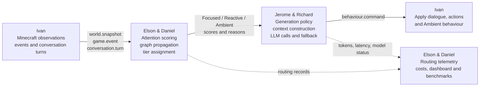
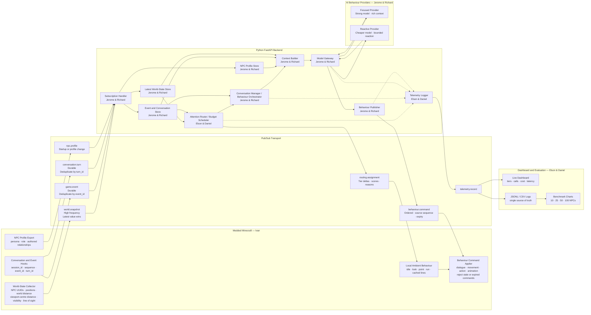

# Spotlight Team Architecture and Ownership

This document is the team’s shared reference for repository structure, named technical ownership, system architecture, module boundaries, handoff responsibilities, and shared integration contracts.

> **Project:** Spotlight — AI Crowd Director  
> **Reference game:** Modded Minecraft  
> **Backend:** Python / FastAPI  
> **Communication:** Pub/Sub  
> **Team:** Elson, Daniel, Jerome, Richard, and Ivan

---

## 1. Repository Structure and Ownership

```text
spotlight/
│
├── minecraft-mod/                         # IVAN
│   │                                      # Owns the complete Minecraft/game side
│   ├── src/
│   │   ├── world_state/                   # IVAN
│   │   │                                  # Collect player/NPC positions, UUIDs,
│   │   │                                  # distances, visibility and world state
│   │   │
│   │   ├── viewport_detection/            # IVAN
│   │   │                                  # Calculate viewport-centre distance,
│   │   │                                  # field of view and line of sight
│   │   │
│   │   ├── npc_control/                   # IVAN
│   │   │                                  # Apply dialogue, actions and tier displays;
│   │   │                                  # execute Ambient/default NPC behaviour
│   │   │
│   │   ├── conversation_hooks/            # IVAN
│   │   │                                  # Detect conversation start/end,
│   │   │                                  # player turns and active NPC target
│   │   │
│   │   └── pubsub_client/                 # IVAN
│   │                                      # Publish Minecraft observations/events;
│   │                                      # subscribe to behaviour commands
│   │
│   └── build.gradle                       # IVAN
│
│
├── backend/
│   │
│   ├── main.py                            # JEROME & RICHARD
│   │                                      # Main FastAPI/backend entry point;
│   │                                      # connects all Python modules
│   │
│   ├── config.py                          # JEROME & RICHARD
│   │                                      # Backend environment variables,
│   │                                      # broker settings and model configuration
│   │
│   ├── ingestion/                         # JEROME & RICHARD
│   │                                      # Pub/sub intake and backend state handling
│   │
│   │   ├── subscriber.py                  # JEROME & RICHARD
│   │   │                                  # Subscribe to world snapshots,
│   │   │                                  # events and conversation turns
│   │   │
│   │   ├── message_validation.py          # JEROME & RICHARD
│   │   │                                  # Validate incoming JSON messages,
│   │   │                                  # IDs, timestamps and required fields
│   │   │
│   │   ├── world_state_store.py           # JEROME & RICHARD
│   │   │                                  # Store only the latest world state;
│   │   │                                  # overwrite obsolete snapshots
│   │   │
│   │   └── event_store.py                 # JEROME & RICHARD
│   │                                      # Store active events and deduplicate
│   │                                      # them using event_id
│   │
│   │
│   ├── router/                            # ELSON & DANIEL
│   │                                      # Complete Graph/Optimisation portion
│   │
│   │   ├── __init__.py                    # ELSON & DANIEL
│   │   │
│   │   ├── config.py                      # ELSON & DANIEL
│   │   │                                  # Scoring weights, capacities,
│   │   │                                  # thresholds, delays and graph decay
│   │   │
│   │   ├── models.py                      # ELSON & DANIEL
│   │   │                                  # Router-specific input/output models
│   │   │
│   │   ├── scoring.py                     # ELSON & DANIEL
│   │   │                                  # Calculate viewport, proximity,
│   │   │                                  # event and interaction scores
│   │   │
│   │   ├── graph.py                       # ELSON & DANIEL
│   │   │                                  # Temporary attention graph and
│   │   │                                  # one-hop attention propagation
│   │   │
│   │   ├── assignment.py                  # ELSON & DANIEL
│   │   │                                  # Assign Focused, Reactive and Ambient;
│   │   │                                  # enforce hard capacity limits
│   │   │
│   │   ├── hysteresis.py                  # ELSON & DANIEL
│   │   │                                  # Promote quickly, demote slowly;
│   │   │                                  # prevent tier flickering
│   │   │
│   │   ├── state.py                       # ELSON & DANIEL
│   │   │                                  # Previous tiers, session state,
│   │   │                                  # sequence tracking and state cleanup
│   │   │
│   │   ├── router.py                      # ELSON & DANIEL
│   │   │                                  # Public route(snapshot) entry point
│   │   │
│   │   └── tests/                         # ELSON & DANIEL
│   │       ├── test_scoring.py
│   │       ├── test_capacity.py
│   │       ├── test_conversation.py
│   │       ├── test_graph.py
│   │       ├── test_hysteresis.py
│   │       ├── test_stale_sequences.py
│   │       └── test_random_stress.py
│   │
│   │
│   ├── orchestration/                     # JEROME & RICHARD
│   │                                      # Decide whether an NPC actually needs
│   │                                      # a new generated behaviour
│   │
│   │   ├── conversation_manager.py        # JEROME & RICHARD
│   │   │                                  # Manage IDLE, ENGAGED,
│   │   │                                  # AWAITING_RESPONSE and READY states
│   │   │
│   │   ├── generation_policy.py           # JEROME & RICHARD
│   │   │                                  # Trigger generation only for a new turn,
│   │   │                                  # relevant event, promotion or expiry
│   │   │
│   │   ├── deduplication.py               # JEROME & RICHARD
│   │   │                                  # Prevent repeated generation for the
│   │   │                                  # same NPC, event and conversation turn
│   │   │
│   │   └── behaviour_publisher.py         # JEROME & RICHARD
│   │                                      # Publish dialogue/action commands
│   │                                      # back to Minecraft
│   │
│   │
│   ├── context/                           # JEROME & RICHARD
│   │                                      # Build the information supplied to LLMs
│   │
│   │   ├── context_builder.py             # JEROME & RICHARD
│   │   │                                  # Combine persona, event, world state
│   │   │                                  # and recent conversation
│   │   │
│   │   ├── npc_profiles.py                # JEROME & RICHARD
│   │   │                                  # Load NPC names, roles,
│   │   │                                  # personalities and relationships
│   │   │
│   │   ├── conversation_history.py        # JEROME & RICHARD
│   │   │                                  # Store recent turns and prepare
│   │   │                                  # promotion/context handoff
│   │   │
│   │   └── event_context.py               # JEROME & RICHARD
│   │                                      # Convert structured game events
│   │                                      # into relevant prompt context
│   │
│   │
│   ├── models/                            # JEROME & RICHARD
│   │                                      # LLM integration and provider selection
│   │
│   │   ├── model_gateway.py               # JEROME & RICHARD
│   │   │                                  # Route Focused and Reactive requests
│   │   │                                  # to the configured providers
│   │   │
│   │   ├── focused_provider.py            # JEROME & RICHARD
│   │   │                                  # Strong-model client
│   │   │
│   │   ├── reactive_provider.py           # JEROME & RICHARD
│   │   │                                  # Cheaper/smaller-model client
│   │   │
│   │   ├── mock_provider.py               # JEROME & RICHARD
│   │   │                                  # Deterministic mock responses
│   │   │                                  # for development and backup
│   │   │
│   │   ├── fallback.py                    # JEROME & RICHARD
│   │   │                                  # Timeout, failure and cached/scripted
│   │   │                                  # fallback handling
│   │   │
│   │   └── prompts/                       # JEROME & RICHARD
│   │       ├── focused_prompt.py
│   │       └── reactive_prompt.py
│   │
│   │
│   └── telemetry/                         # ELSON & DANIEL
│                                          # Measurement and optimisation evidence
│
│       ├── logger.py                      # ELSON & DANIEL
│       │                                  # Record scores, assignments,
│       │                                  # tier changes and model-call results
│       │
│       ├── cost_calculator.py             # ELSON & DANIEL
│       │                                  # Calculate actual routed cost and
│       │                                  # projected baseline cost
│       │
│       ├── metrics.py                     # ELSON & DANIEL
│       │                                  # Calls, tokens, latency, fallbacks,
│       │                                  # tier switches and capacity usage
│       │
│       └── benchmark.py                   # ELSON & DANIEL
│                                          # Run and compare 10, 25, 50 and
│                                          # 100-NPC experiments
│
│
├── dashboard/                             # ELSON & DANIEL
│   │                                      # Live visualisation of routing and costs
│   ├── src/
│   │   ├── tier_display/                  # ELSON & DANIEL
│   │   ├── routing_reasons/               # ELSON & DANIEL
│   │   ├── cost_metrics/                  # ELSON & DANIEL
│   │   └── benchmark_charts/              # ELSON & DANIEL
│   └── package.json                       # ELSON & DANIEL
│
│
├── data/
│   ├── npc_profiles.json                  # JEROME & RICHARD
│   │                                      # NPC personas, roles and authored context
│   │
│   ├── cached_dialogue.json               # JEROME & RICHARD
│   │                                      # Scripted and fallback dialogue
│   │
│   └── benchmark_runs/                    # ELSON & DANIEL
│                                          # Recorded router and model telemetry
│
│
├── scripts/
│   ├── run_backend.py                     # JEROME & RICHARD
│   │                                      # Start FastAPI, subscribers and
│   │                                      # backend services
│   │
│   ├── run_benchmark.py                   # ELSON & DANIEL
│   │                                      # Execute repeatable benchmark traces
│   │
│   └── generate_charts.py                 # ELSON & DANIEL
│                                          # Convert benchmark logs into charts
│
│
├── tests/
│   └── test_end_to_end.py                 # ELSON, DANIEL, JEROME, RICHARD & IVAN
│                                          # Joint integration test covering:
│                                          # Minecraft → router → LLM → Minecraft
│
│
├── docs/
│   ├── team-architecture.md               # ALL FIVE MEMBERS
│   │                                      # Named ownership and handoff reference
│   │
│   ├── architecture.md                    # ALL FIVE MEMBERS
│   │                                      # Final agreed system architecture
│   │
│   ├── message_schemas.md                 # ALL FIVE MEMBERS
│   │                                      # Joint contract between Minecraft,
│   │                                      # router and backend portions
│   │
│   ├── benchmark_methodology.md           # ELSON & DANIEL
│   │                                      # Baselines, metrics and test procedure
│   │
│   └── demo_script.md                     # ALL FIVE MEMBERS
│                                          # Final five-minute demonstration flow
│
│
├── .env.example                           # JEROME & RICHARD
│                                          # Required environment variables
│                                          # without real API credentials
│
├── requirements.txt                       # JEROME & RICHARD
│                                          # Shared Python dependencies
│
└── README.md                              # ALL FIVE MEMBERS
                                           # Final project explanation, setup,
                                           # architecture and disclosure
```

---

## 2. Ownership Summary

| Members | Primary ownership |
|---|---|
| **Elson & Daniel** | Attention Router, graph/optimisation, routing telemetry, dashboard, benchmarks, and cost evidence |
| **Jerome & Richard** | Backend ingestion, event handling, conversation orchestration, context construction, LLM integration, fallbacks, and behaviour publishing |
| **Ivan** | Minecraft mod, world-state collection, viewport detection, event/conversation hooks, pub/sub client, NPC control, and local Ambient behaviour |
| **All five members** | Shared schemas, end-to-end integration, architecture documentation, README, and demo script |

---

## 3. End-to-End Ownership Flow



---

## 4. Complete System Architecture



---

## 5. Elson & Daniel — Graph, Optimisation and Evaluation

Owned paths:

```text
backend/router/
backend/telemetry/
dashboard/
data/benchmark_runs/
scripts/run_benchmark.py
scripts/generate_charts.py
docs/benchmark_methodology.md
```

Responsibilities:

1. Convert raw Minecraft observations into routing scores.
2. Calculate viewport, proximity, event and interaction relevance.
3. Implement one-hop temporary attention-graph propagation.
4. Assign Focused, Reactive and Ambient tiers.
5. Enforce hard Focused and Reactive capacity limits.
6. Prioritise active conversations.
7. Implement hysteresis: promote quickly and demote slowly.
8. Reject stale sequences and maintain routing-session state.
9. Return scores, tier transitions and readable routing reasons.
10. Record routing and model telemetry.
11. Calculate actual and projected model cost.
12. Produce dashboard metrics and benchmark charts.
13. Run tests at 10, 25, 50 and 100 NPCs.

Public interface:

```python
routing_result = router.route(world_snapshot)
```

The router returns assignments.

The router does not:

- Call an LLM.
- Construct prompts.
- Generate dialogue.
- Control Minecraft entities directly.

---

## 6. Jerome & Richard — Backend, Context, Events and LLMs

Owned paths:

```text
backend/main.py
backend/config.py
backend/ingestion/
backend/orchestration/
backend/context/
backend/models/
data/npc_profiles.json
data/cached_dialogue.json
scripts/run_backend.py
.env.example
requirements.txt
```

Responsibilities:

1. Receive pub/sub messages.
2. Validate message schemas, IDs, timestamps and sequence information.
3. Coalesce high-frequency world snapshots so the latest state wins.
4. Store durable events and conversation turns.
5. Deduplicate `event_id` and `turn_id`.
6. Consume routing assignments from Elson and Daniel.
7. Decide whether a new generation is required.
8. Avoid generating dialogue simply because another world snapshot arrived.
9. Construct context using persona, event, world state and recent dialogue.
10. Route Focused and Reactive requests to their configured providers.
11. Implement mock mode, timeouts and scripted fallbacks.
12. Publish fresh, ordered and expiring behaviour commands.
13. Report tokens, latency, provider status and fallbacks to telemetry.

Generation should occur only after a meaningful trigger:

- A new conversation turn.
- A new relevant event.
- A promotion requiring new foreground behaviour.
- Existing behaviour expiry.

An NPC remaining in the same tier does not automatically require another model call.

---

## 7. Ivan — Minecraft Game and Integration

Owned path:

```text
minecraft-mod/
```

Responsibilities:

1. Read player and NPC world state.
2. Use stable Minecraft NPC UUIDs.
3. Calculate world distance.
4. Calculate viewport-centre distance.
5. Detect visibility and line of sight.
6. Detect conversation start, turns and end.
7. Detect and publish structured world events.
8. Publish high-frequency world snapshots.
9. Subscribe to routing assignments and behaviour commands.
10. Apply valid dialogue and NPC actions.
11. Reject stale, expired or irrelevant commands.
12. Execute Ambient/default behaviours locally.
13. Keep the Minecraft simulation thread non-blocking.

Minecraft publishes raw observations.

Minecraft does not:

- Calculate the final routing priority.
- Assign the final AI tier.
- Call an LLM directly.
- Block its main game thread while waiting for Python.

---

## 8. Shared Message Contracts

The team must agree on these message structures before completing the integrations.

### World snapshot

```json
{
  "type": "world_snapshot",
  "session_id": "demo-01",
  "sequence": 1842,
  "timestamp_ms": 1786208500123,
  "npcs": [
    {
      "npc_id": "shopkeeper-uuid",
      "world_distance": 3.4,
      "viewport_center_distance": 0.07,
      "visible": true,
      "line_of_sight": true,
      "event_relevance": 1.0,
      "interaction_recency": 0.8,
      "active_conversation": false
    }
  ]
}
```

High-frequency world snapshots use latest-value-wins semantics.

Older positional state may be replaced by newer state.

Receiving a world snapshot does not automatically trigger an LLM request.

### Game event

```json
{
  "type": "game_event",
  "event_id": "market-theft-001",
  "event_type": "market_theft",
  "summary": "A thief stole bread from the market stall.",
  "participants": [
    "thief-uuid",
    "shopkeeper-uuid"
  ]
}
```

Game events are durable and deduplicated by `event_id`.

### Conversation turn

```json
{
  "type": "conversation_turn",
  "conversation_id": "conversation-07",
  "turn_id": "turn-004",
  "npc_id": "shopkeeper-uuid",
  "player_text": "Which direction did the thief run?"
}
```

Conversation turns are durable and deduplicated by `turn_id`.

A conversation turn should trigger at most one generation request.

### Routing assignment

```json
{
  "npc_id": "shopkeeper-uuid",
  "tier": "focused",
  "previous_tier": "reactive",
  "changed": true,
  "direct_score": 10.91,
  "propagated_score": 0.0,
  "final_score": 10.91,
  "reasons": [
    "active conversation",
    "near viewport centre",
    "direct event participant",
    "selected within Focused capacity"
  ]
}
```

### Behaviour command

```json
{
  "type": "behaviour_command",
  "command_id": "command-322",
  "npc_id": "shopkeeper-uuid",
  "conversation_id": "conversation-07",
  "turn_id": "turn-004",
  "event_id": "market-theft-001",
  "tier": "focused",
  "dialogue": "Towards the fountain! He was carrying my bread.",
  "action": "point_towards_fountain",
  "source_sequence": 1842,
  "expires_at_ms": 1786208515000
}
```

Minecraft applies the command only when:

- The NPC still exists.
- The command is newer than the last applied command.
- The related event or conversation is still current.
- The command has not expired.

---

## 9. Non-Negotiable System Rules

1. A world snapshot does not automatically trigger an LLM call.
2. The router assigns tiers but does not generate dialogue.
3. Conversation turns and game events must not be silently dropped.
4. Old positional snapshots may be overwritten by newer ones.
5. Focused and Reactive capacity limits must never be exceeded.
6. Active conversation receives the highest routing priority.
7. Promotion is fast; demotion is delayed to prevent tier flicker.
8. Ambient/default behaviour executes inside Minecraft.
9. LLM calls must not block Minecraft’s game thread.
10. Generated commands must contain sequence and expiry information.
11. Stale or expired behaviour commands must be rejected.
12. Dashboard and benchmark results must use the same telemetry records.
13. No API keys, passwords or secrets may be committed.

---

## 10. Branch Convention

Recommended feature branches:

```text
feature/minecraft-integration
feature/router
feature/context-orchestration
feature/model-gateway
feature/telemetry-dashboard
```

Recommended integration branches:

```text
develop
main
```

Recommended workflow:

1. Work on the relevant feature branch.
2. Pull the latest version of `develop`.
3. Run the relevant module tests.
4. Open a pull request into `develop`.
5. Run the end-to-end integration test.
6. Merge stable versions from `develop` into `main`.

Do not force-push shared branches unless the entire team explicitly agrees.

---

## 11. Daily Integration Rule

> At the end of every development day, the full project must still run end-to-end in mock-model mode.

Mock mode allows:

- Ivan to test incoming behaviour commands.
- Elson and Daniel to test routing assignments and telemetry.
- Jerome and Richard to test orchestration without model cost.
- The whole team to rehearse when an external model provider is unavailable.

---

## 12. Scope Boundary

### Build during the core sprint

- Modded Minecraft reference game.
- Pub/sub communication.
- High-frequency world-state updates.
- Durable event and conversation messages.
- Attention routing.
- Focused, Reactive and Ambient tiers.
- Hard capacity limits.
- Hysteresis.
- One-hop temporary attention propagation.
- Context construction.
- Focused and Reactive model calls.
- Ambient local behaviour.
- Asynchronous fallback handling.
- Routing and cost telemetry.
- Dashboard and benchmark results.

### Do not build during the core sprint

- Graph RAG.
- Persistent long-term NPC memory.
- Voice input or output.
- Another 3D game outside Minecraft.
- A production SDK.
- A public hosted API product.
- Authentication.
- Multiple maps before the core workflow is stable.
- A learned router.
- Reinforcement-learning routing.

---

## 13. Jointly Owned Files

All five members must review:

```text
tests/test_end_to_end.py
docs/team-architecture.md
docs/architecture.md
docs/message_schemas.md
docs/demo_script.md
README.md
```

No ownership group should change a shared message contract without informing the other two groups.

---

## 14. Final Handoff Sequence

```text
Ivan
publishes raw Minecraft observations, events and turns
        ↓
Elson & Daniel
calculate attention and assign AI tiers
        ↓
Jerome & Richard
decide whether generation is required,
construct context and call the correct model
        ↓
Ivan
applies dialogue, actions and local Ambient behaviours
        ↓
Elson & Daniel
record routing, cost, latency and benchmark evidence
```
